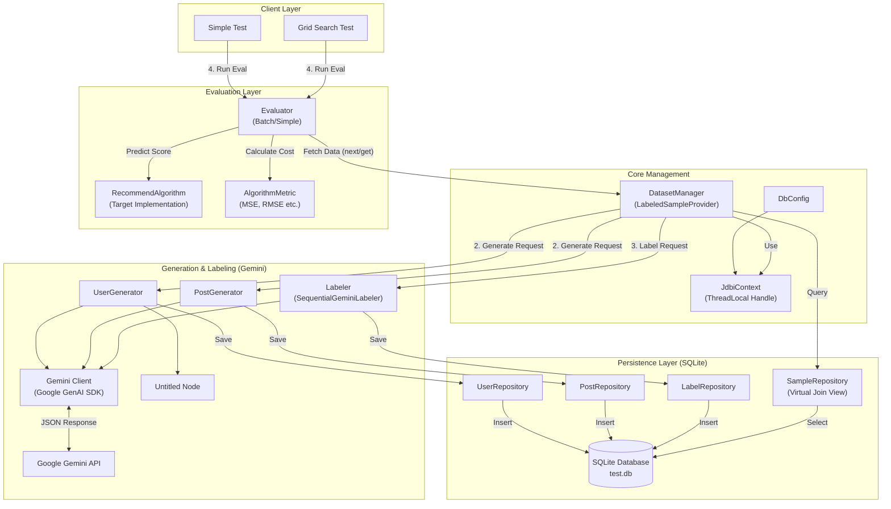
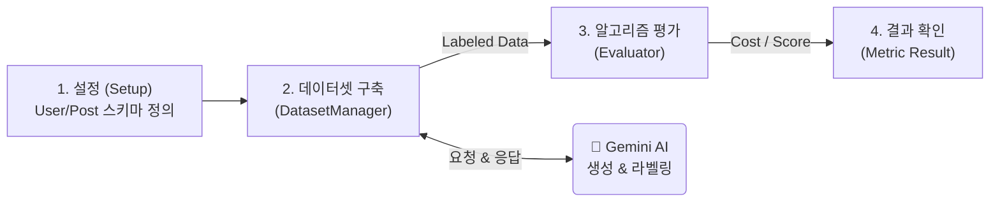
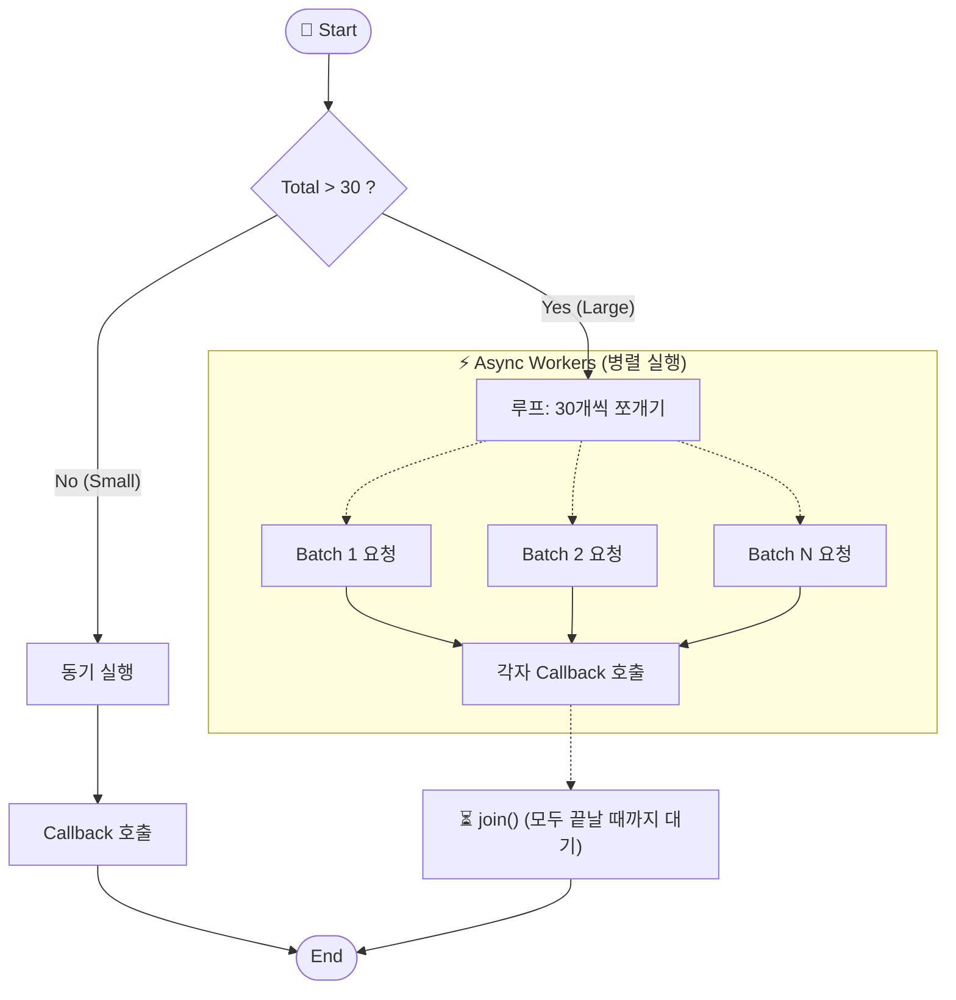
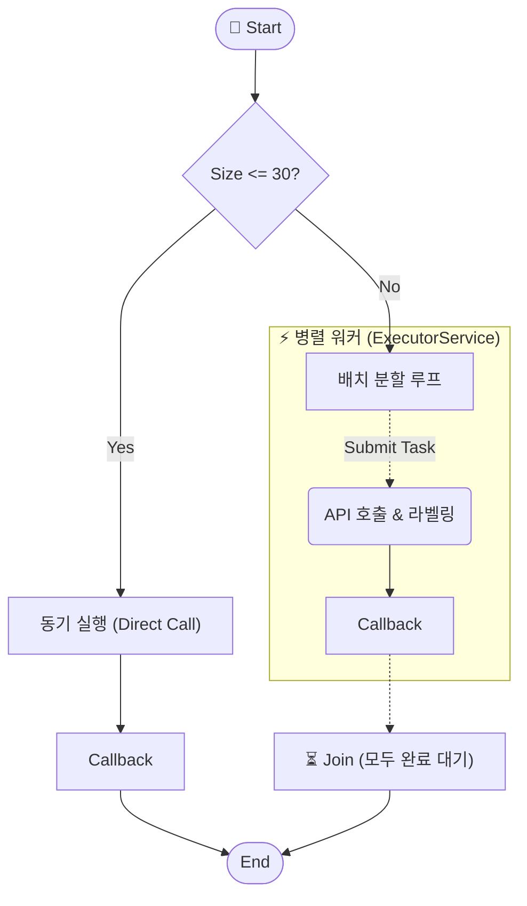

## 제작한 이유

추천 알고리즘을 만들었지만 정작 잘 작동하는지 테스트하는 것은 매우 어렵다.

사람마다 추천에 대한 만족도 기준도 주관적이고 절대적인 정답이 없는 기능이기 때문이다. (정성 지표)

앱 이용자들이나, 테스트 유저들을 모집하여 피드백을 받고 얻은 데이터를 통해 추천 기능을 평가하고 개선하는 것이 제일 좋겠지만 개발중인 앱이거나 이러한 여건이 되지 않는 앱이라면 이러한 방식은 도입하는 것은 불가능하다.

이러한 앱들을 위해 대신 llm을 이용하여 데이터 셋들을 만들어 추천 알고리즘을 정량적으로 평가한다.

### 간단한 사용법

### Jatpack을 통한 의존성 설치

```java
	<repositories>
		<repository>
		    <id>jitpack.io</id>
		    <url>https://jitpack.io</url>
		</repository>
	</repositories>
		<dependency>
	    <groupId>com.github.jintakkim</groupId>
	    <artifactId>postevaluator</artifactId>
	    <version>1.0.0</version>
	</dependency>
```

### **applicationConfig를 자신의 추천 알고리즘의 상황에 맞춰서 구성한다.**

applicationConfig는 3가지 Properties를 받는다.

| 이름 | 설명 |
| --- | --- |
| DefinitionProperties | 사용자의 앱의 특성에 맞춰 유저 및 게시판 특징을 정의한다. 빌트인이 정의되어 있어 간단하게 설정 가능하다. |
| DatasetProperties | 생성하기를 원하는 유저, 게시글 데이터셋 사이즈를 정의한다.  |
| AlgorithmMetricProperties | 평가 방식을 정의한다. 빌트인으로 MSE, RMSE가 정의되어 있지만 필요시 직접 구현가능하다. |
| geminiProperties | gemini api키를 정의한다. api키로 null값을 넣으면 환경변수 GOOGLE_API_KEY로 key를 읽는다. |
| searchProperties | 그리드 서치에 사용되는 하이퍼 파라미터를 정의한다. |

빌트인을 사용한 applicationConfig 구성 예시

```java
ApplicationConfig applicationConfig = new ApplicationConfig(
						new GeminiProperties("google_api_key"),
            new DefinitionProperties(
                    DefinitionProperties.BuiltIn.USER_DEFINITION.ALL_BUILTIN_FEATURES_APPLIED,
                    DefinitionProperties.BuiltIn.POST_DEFINITION.ALL_BUILTIN_FEATURES_APPLIED
            ),
            DatasetProperties.defaults(),
            new AlgorithmMetricProperties(AlgorithmMetricProperties.BuiltIn.MEAN_SQUARED_ERROR)
    );
```

### RecommendTest를 생성한다.

```java
PostRecommendTest postRecommendTest = new PostRecommendTest(applicationConfig);
```

### 테스트를 진행한다.

테스트 타입

| 이름 | 설명 |
| --- | --- |
| simpleTest | 주어진 알고리즘을 평가한다. |
| gridSearchTest | 주어진 알고리즘을 그리드 서치를 통해 평가한다.  |

테스트 text를 출력하고 싶다면 

```java
//simpleTest 결과 출력
System.out.println(ResultFormatter.formatEvaluateResult(evaluateResult));
//gridSearchTest 결과 출력
System.out.println(ResultFormatter.formatSearchResult(searchResult));
```

# 실행 결과


그리드 서치 결과.

## 주요기능

---

**주요 패키지들**

| 패키지명 | 설명 |
| --- | --- |
| client | 테스트 라이브러리의 시작점, 사용자들이 사용한다. |
| generation | llm을 이용하여 데이터 셋을 만든다. |
| labeling | generation패키지에서 생성된 데이터 셋을 llm을 통해 평가(라벨링)한다. |
| persistance | 라벨링된 데이터 셋을 캐쉬하고 추후 추천 알고리즘 평가에 제공한다. |
| evalutation | 추천 알고리즘을 라벨링된 데이터 셋을 이용하여 테스트한다. |

**전반적인 라이브러리 아키텍처**



## 전반적인 어플리케이션 흐름



# 자세한 설정 값 설명

---

### DefinitionProperties

테스트 하고 싶은 추천 알고리즘의 인자를 동적으로 설정한다.

UserDefinition, PostDefinition으로 구성이 된다.

위 값을 기준으로 런타임에 데이터베이스 스키마를 구성된다.

테스트 중 둘중 한개의 구성이 바뀌게 된다면 기존 테이블이 drop되고 새롭게 데이터베이스 스키마를 구성한다.

**만일 추천 알고리즘에서 유저가 좋아하는 토픽, 싫어하는 토픽, 선호하는 문장 길이 수를 고려한다면 아래와 같이 추가한다. (빌트인을 사용한 간단하게 추가한 예시)**

```java
new UserDefinition(
	Map.of(
	        DefinitionProperties.Builtin.USER_FEATURE.LIKE_TOPICS.name(), 
	        DefinitionProperties.Builtin.USER_FEATURE.LIKE_TOPICS,
	        DefinitionProperties.Builtin.USER_FEATURE.DISLIKE_TOPICS.name(), 
	        DefinitionProperties.Builtin.USER_FEATURE.DISLIKE_TOPICS,
	        DefinitionProperties.Builtin.USER_FEATURE.PREFERRED_LENGTH.name(), 
	        DefinitionProperties.Builtin.USER_FEATURE.PREFERRED_LENGTH
	),
	LabelingCriteria.builder()
	        .addCriterion("좋아하는 주제를 고려하여 점수 부여")
	        .addCriterion("싫어하는 주제를 고려하여 점수 부여")
	        .addCriterion("선호하는 문장 길이를 고려하여 점수 부여")
	        .build()
);
```

### FeatureDefinition

유저 설정(UserDefinition)이나 게시물 설정(PostDefinition)은 여러 특징 설정을 넣을 수 있다.

여기서 설정되는 FeatureType을 기준으로 Db 컬럼 타입 설정 등 전반적인 어플리케이션 타입 체크 및 파싱 로직이 작동되므로 정확한 타입을 기입해야되고 추후 알고리즘 구현시에도 여기서 정의한 타입과 일치해야한다.

**만약 게시물 특징에 글쓴이의 명성도를 간단하게 추가하고 싶다면 아래와 같이 구성할 수 있다.**

```java
new FeatureDefinition(
	"reputation",
	FeatureType.DOUBLE,
	new NumberTypeGenerationCriteriaBuilder.MinMaxBuilder()
		.min(0.0)
    .max(1.0)
    .addCondition("작성자의 명성을 나타내는 스코어", "클 수록 명성이 높게 생성")
    .build()
);
```

---

## DatasetProperties

데이터 셋 관리 설정을 한다.

유저 데이터셋, 게시물 데이터셋 개수 설정, SetupStrategy 설정이 가능하다.

SetupStrategy 별 동작 설명

| 이름 | 설명 |
| --- | --- |
| CLEAR | 캐쉬된 유효한 데이터셋이 있어도 기존 데이터 셋을 전부 삭제하고 다시 데이터셋을 생성한다. |
| REUSE_PARTITION | 캐쉬된 유효한 데이터셋이 있다면 기존 데이터 셋중 일부를 재사용한다. 캐쉬된 데이터셋이 설정한 크기보다 많을 경우 pk기준으로 오름차순으로 일부를 선택한다. 적을 경우에는 필요한 데이터셋을 추가로 더 만든다. |
| REUSE_STRICT | 캐쉬된 유효한 데이터셋이 있다면 기존 데이터 셋을 재사용한다. 캐쉬된 데이터셋이 설정한 크기보다 많을 경우 예외를 발생시킨다. 적을 경우에는 필요한 데이터셋을 추가로 더 만든다. |

---

## Generator 동작 설명

Generator를 통해 데이터를 만든다.

llm api 출력 토큰 제한으로 인해 30개보다 초과된 데이터가 설정되었더라면 병렬 요청으로 전환된다. 

gemini는 암시적 캐싱을 지원하기 떄문에 비슷한 타입의 요청은 낮은 비용으로 여러번 호출할 수 있다.

### 실행 화면(게시글 생성기)


### Generator 동작 다이어그램



## Labeler 동작 설명

generator를 통해 만든 데이터를 평가한다.

게시글과 유저를 조합하여 라벨링을 하기 때문에 단순히 게시글 데이터수를 20개 유저 데이터수를 20개로 설정해도 총 400개의 라벨링 데이터를 만들게 된다.

평가시 DefinitionProperties에서 설정된 LabelingCriteria를 전달하여 어떤 기준으로 라벨링을 진행할지 전달할 수 있다.

llm api 출력 토큰 제한으로 인해 30개 이상의 데이터가 설정되었더라면 병렬 요청으로 전환된다. 

### 실행 화면


### Labeler 동작 다이어그램



---

## Evaluator 동작 설명

라벨링된 게시글, 유저 데이터를 Cross Join하여 셈플 데이터를 만든다.

사용자가 평가하고 싶은 알고리즘은 이 샘플 데이터를 받게 되며 받는 샘플데이터를 평가후 0.0~1.0사이의 스코어로 변환해서 응답하는 알고리즘을 구현하면 된다.

**사용자가 구현해야하는 인터페이스(추천 알고리즘)**
